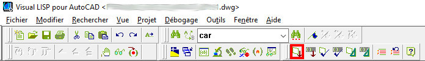
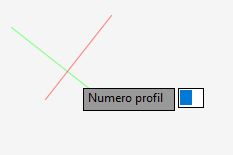
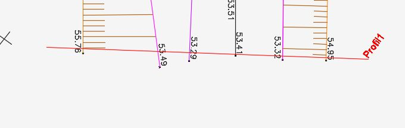
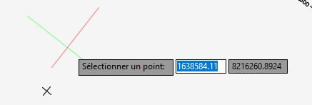
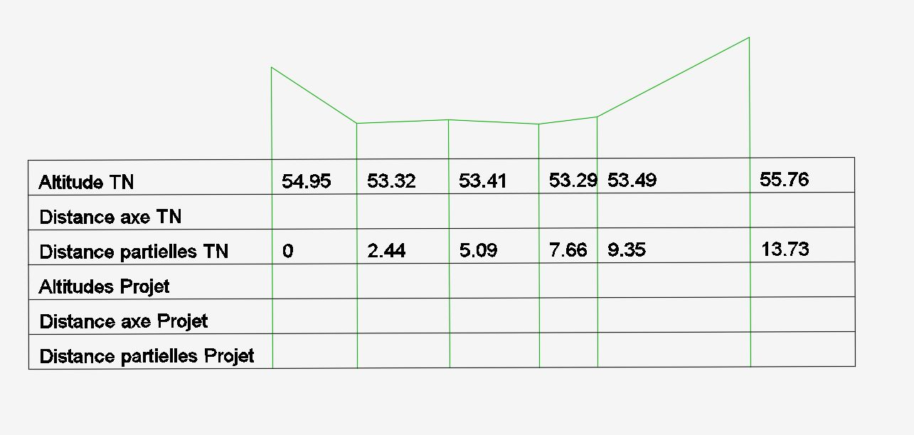
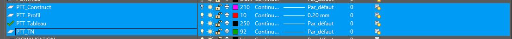

PTT_lsp
================
Macro AutoLISP permettant d'automatiser la création de profils en travers pour des projets routiers.

Installation à partir de github
-------------------------------

	cd ./
	git clone https://github.com/IDTruke/PTT_lsp

Activation de la macro dans Autocad
-----------------------------------

* Ouvrir l'éditeur visuel Autolisp (Menu Outils -> AutoLISP -> Editeur Visual LISP)
* Charger le fichier PTT_lsp.lsp
* Activer la macro dans le dessin Autocad actif :

Démarrer la macro
-----------------

* Dans le projet Autocad, appeler la macro en tapant 'PTT' puis Entrée

Utilisation du plugin
---------------------

* Dans un premier temps vous allez devoir créer la ligne représentant votre emplacement de profil en travers en saisissant les points 1 & 2
* Puis entrer le nom affiché du profil

* Ensuite, pour chacun des points topo, cliquer sur son emplacement et saisir le Z (Faites attention avec les accrochages!)

Un tracé de construction reliant le point topo au profil apparaitra jusqu'à la fin de la saisie

* Quand vous n'avez plus de points topo taper une fois Entrée
* Saisir l'emplacement pour le dessin du profil en travers
* Fin de la saisie !

Commentaires
------------

La macro va créer 4 calques préfixés en 'PTT_' dans votre projet dont un sera inactif (traits de constructions).

